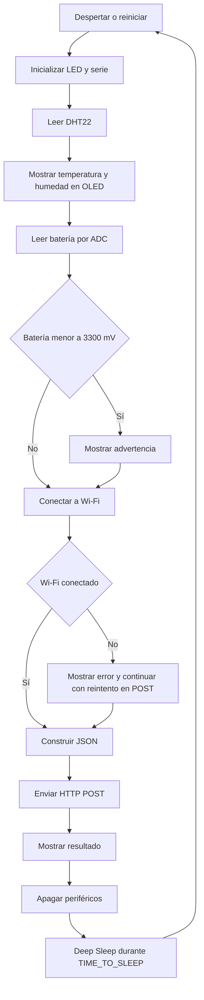

# TemHum_IA

## 🌡️ Sistema IoT de Medición de Temperatura y Humedad

### Descripción general

**TemHum_IA** es un prototipo de sistema IoT orientado a la medición de temperatura y humedad relativa en ambientes interiores. Utiliza el sensor **DHT22** y la placa **Heltec WiFi LoRa 32 (V3)**, que integra un microcontrolador **ESP32-S3**, conectividad Wi-Fi y pantalla OLED.

El sistema captura lecturas ambientales, las visualiza en pantalla OLED y las transmite mediante **HTTP POST (JSON)** a un servidor remoto. Además, implementa ciclos de **Deep Sleep (modo de sueño profundo)** para extender la autonomía de la batería recargable que lo alimenta.

---

## ⚙️ Funcionalidades principales

- Lectura de temperatura y humedad con sensor **DHT22**.
- Visualización de datos en pantalla OLED integrada.
- Medición del voltaje de batería.
- Transmisión de datos vía **Wi-Fi** mediante **HTTP POST**.
- Alertas visuales mediante **pantalla OLED** y **LED interno**.
- Gestión energética con **Deep Sleep** cada 300 segundos **(5 minutos)**.

---

## 📂 Estructura del proyecto

Este repositorio contiene tanto el **código fuente** como la **documentación técnica** del sistema TemHum_IA.

---

### 🔧 Código fuente

El código está organizado en módulos para facilitar su mantenimiento y escalabilidad. Se puede compilar usando **Arduino IDE** o **PlatformIO**.

#### Archivos principales
- `final_Code.ino`: flujo principal del programa
- `parameters.h`: definición de pines, tiempos y constantes
- `lectura_DHT.h`, `lectura_Vbatt.h`: adquisición de datos
- `wifi_ON.h`, `envioDatosPOST.h`: conectividad y transmisión
- `oled_ON.cpp/.h`, `uso_LED.h`: visualización en OLED y LED interno
- `dormir_Placa.h`: control del modo Deep Sleep

---

## 📦 Librerías necesarias

Para compilar correctamente el proyecto, asegurarse de instalar las siguientes librerías en el Arduino IDE:

### 📚 Sensor DHT22
- **DHT sensor library**  
  https://github.com/adafruit/DHT-sensor-library
- **Adafruit Unified Sensor**  
  https://github.com/adafruit/Adafruit_Sensor

### 📚 Pantalla OLED (I2C)
- **HT_SSD1306Wire** *(o equivalente compatible con OLED 0.96” de Heltec)*  
  Incluida generalmente con el framework de Heltec

### 📚 Conectividad Wi-Fi y HTTP
- **WiFi**
- **HTTPClient**
- **esp_wifi**
- **esp_sleep**

---

> ⚠️ Asegurarse de tener instalado el **ESP32 Board Package** en el **Boards Manager** del Arduino IDE.


## 🛠️ Instalación del soporte para ESP32 en Arduino IDE

Para poder compilar y cargar correctamente este proyecto en una placa ESP32, es necesario instalar el paquete oficial de placas ESP32 en el **Arduino IDE**.

### 🔗 URL del gestor de tarjetas

Agregar la siguiente URL en las preferencias del Arduino IDE:
- **https://espressif.github.io/arduino-esp32/package_esp32_index.json**
- Rama de desarrollo: https://raw.githubusercontent.com/espressif/arduino-esp32/gh-pages/package_esp32_dev_index.json

### 🧭 Pasos para la instalación

1. **Abrir el Arduino IDE**.
2. Dirigirse a `Archivo` → `Preferencias`.
3. En el campo **"Gestor de URLs Adicionales de Tarjetas"**, pegar la URL anterior.
   > Si ya hay URLs añadidas, separalas con una coma.
4. Hacer clic en **"OK"** para guardar.
5. Ahora dirigirse a `Herramientas` → `Placa` → `Gestor de placas o tarjetas`.
6. Buscar "**esp32**" y seleccionar la opción publicada por **Espressif Systems**.
7. Hacer clic en **"Instalar"**
8. Esperar a que finalice la descarga e instalación (puede tardar unos minutos).

Una vez completado, se podrá seleccionar la placa como la **Heltec WiFi LoRa 32 (ESP32-S3)** desde el menú de placas.

> ✅ Recomendación: Tener el Arduino IDE actualizado.

---

## 🧠 Funcionamiento del código de `finalCode_AllCommented_OK`

La carpeta `finalCode_AllCommented_OK` contiene la versión modular del firmware que actualmente se ejecuta en una **Heltec WiFi LoRa 32 V3**, basada en el **ESP32-S3**. Su objetivo es realizar una medición ambiental, mostrar el resultado localmente, enviarlo a un servidor y apagar el microcontrolador hasta el siguiente ciclo. El diseño está orientado a reducir el consumo de batería mediante ciclos periódicos de activación y sueño profundo.

### Arquitectura de archivos

El programa se divide en un archivo principal y varios módulos especializados. `includess.h` funciona como punto de unión: incluye los parámetros y las funciones de sensores, pantalla, conectividad, envío de datos y ahorro de energía.

- `finalCode_AllCommented_OK.ino`: coordina el ciclo completo dentro de `setup()`.
- `includess.h`: centraliza las inclusiones de los demás módulos.
- `parameters.h`: define pines, tipo de sensor y tiempo de sueño.
- `lectura_DHT.h`: inicializa el DHT22 y devuelve temperatura y humedad.
- `lectura_Vbatt.h`: mide la tensión de batería mediante el ADC.
- `wifi_ON.h`: configura el ESP32 como cliente Wi-Fi y gestiona la conexión.
- `envioDatosPOST.h`: construye el JSON y realiza la petición HTTP POST.
- `oled_ON.h` y `oled_ON.cpp`: declaran e implementan la pantalla OLED, sus mensajes y su alimentación.
- `uso_LED.h`: inicializa el LED interno como indicador de estado.
- `dormir_Placa.h`: desconecta periféricos y activa el Deep Sleep.

### Ciclo completo de ejecución

El firmware no utiliza `loop()` para repetir el proceso. Todo el ciclo está en `setup()` porque `esp_deep_sleep_start()` detiene la ejecución y, al despertar por temporizador, el ESP32 vuelve a arrancar desde el principio. Con `TIME_TO_SLEEP` configurado en `300`, el ciclo nominal se repite cada cinco minutos, aunque el tiempo real entre mediciones también incluye los retardos de pantalla, sensor, Wi-Fi y HTTP.

El flujo es el siguiente:

1. Se inicia el puerto serie a `115200` baudios y se apaga el LED como estado inicial.
2. `dataRead_DHT()` inicializa el DHT22 conectado a `DHTPIN`, lee temperatura y humedad y devuelve ambos valores mediante punteros. Si la librería devuelve `NaN`, se muestra un error, se señaliza con el LED y ambas variables quedan en `0`.
3. `mostrarDatosOLED()` enciende la alimentación `Vext`, inicializa la OLED SSD1306 por I2C y muestra temperatura y humedad durante dos segundos.
4. `read_VBatt()` activa el circuito de medición, configura el ADC a 12 bits y lee `PIN_VBAT_ADC`. La lectura en mV se multiplica por `4.9` para compensar el divisor resistivo usado en la placa actual. El resultado se guarda como `V_batt`.
5. Si `V_batt` es menor que `3300` mV, `mostrarAdvertenciaBateria()` muestra la alerta y hace parpadear el LED. Esta advertencia no detiene el ciclo ni impide el envío.
6. `connectWiFi()` configura el modo estación, intenta conectarse durante un máximo de diez segundos y muestra el progreso en la OLED y el LED. Si se conecta, obtiene la dirección MAC y establece el ahorro de energía Wi-Fi `WIFI_PS_MIN_MODEM`.
7. `enviarDatosPorPOST()` comprueba de nuevo el estado de Wi-Fi. Si no hay conexión, llama a `connectWiFi()` para reintentarlo. Después crea un cliente HTTP y envía los datos al endpoint configurado.
8. Se muestra el resultado del envío, se apaga la OLED y `sleep()` desactiva Wi-Fi, Bluetooth, SPI e I2C antes de programar el despertador y entrar en Deep Sleep.



### Cómo colaboran los módulos

La coordinación se realiza mediante funciones y valores que se pasan entre módulos:

- El archivo principal crea `TEM`, `HUM` y `V_batt`. `dataRead_DHT(&TEM, &HUM)` modifica las dos primeras mediante punteros; después esos mismos valores se entregan a la OLED y a `enviarDatosPorPOST()`.
- Las funciones de OLED no reciben el control del flujo. Solo presentan el estado que les solicita el módulo principal, el módulo DHT, el módulo Wi-Fi o el módulo HTTP. Cada pantalla vuelve a encender e inicializar la OLED, por lo que no existe un estado visual persistente entre mensajes.
- El LED se usa como complemento de la OLED: parpadea durante errores de sensor, batería baja, conexión Wi-Fi y POST fallido; permanece encendido brevemente después de un POST correcto.
- El módulo Wi-Fi ofrece `connectWiFi()` y el módulo HTTP depende de él para obtener la conexión y la MAC. La MAC identifica el dispositivo dentro del JSON.
- El módulo de Deep Sleep se ejecuta al final y no devuelve el control en condiciones normales. Al perderse la RAM durante el sueño profundo, no se conservan automáticamente las variables del ciclo anterior.

### Datos enviados al servidor

La petición se envía con `Content-Type: application/json` al endpoint definido en `envioDatosPOST.h`. El cuerpo tiene esta estructura:

```json
{
  "mac": "AA:BB:CC:DD:EE:FF",
  "values": {
    "temperature": 235,
    "humidity": 58
  },
  "battery": {
    "voltage": 3970,
    "level": 0
  }
}
```

`temperature` se transmite como temperatura en grados Celsius multiplicada por diez para conservar un decimal sin usar un `float`; por ejemplo, `23.5 °C` se convierte en `235`. `humidity` se trunca a un entero y `voltage` se expresa en milivoltios. El campo `battery.level` está reservado, pero actualmente siempre vale `0` y no representa un porcentaje calculado.

Un código HTTP positivo se considera actualmente un POST exitoso y se muestra la respuesta del servidor. Los códigos negativos se tratan como errores de transporte. Para una versión de producción conviene distinguir también los códigos HTTP `4xx` y `5xx`, validar el contenido de las lecturas y definir qué debe ocurrir cuando no hay red.

### Puntos que deben revisarse al migrar a otra ESP32

El código actual no es universal para cualquier placa ESP32. Antes de usar una placa de 30 o 38 pines hay que verificar y actualizar:

- `DHTPIN`, según el GPIO elegido para el dato del DHT22.
- `PIN_VBAT_CTRL`, `PIN_VBAT_ADC` y el factor `4.9`, según el divisor resistivo y la calibración ADC de la nueva placa.
- `SDA_OLED`, `SCL_OLED`, `RST_OLED` y `Vext`, ya que en la Heltec V3 algunos valores los proporciona la definición de la placa y están comentados en `parameters.h`.
- El GPIO y la lógica eléctrica del LED interno, porque no todas las ESP32 tienen LED integrado o lo activan con el mismo nivel.
- La librería y el controlador de la OLED de `0.96 pulgadas`, su dirección I2C, resolución `128x64` y alimentación. La implementación actual usa la dirección `0x3C` y `HT_SSD1306Wire`.
- La disponibilidad de Bluetooth, SPI, I2C y las funciones de apagado utilizadas por `dormir_Placa.h`.
- La tensión de alimentación, el divisor de batería y los límites de seguridad antes de conectar el ADC.

También se deben trasladar las credenciales Wi-Fi y la URL del servidor a una configuración segura. En la versión actual están escritas directamente en los archivos fuente y el endpoint utiliza HTTP sin cifrado, por lo que no conviene conservar esos valores en un repositorio público ni usar el mismo esquema sin evaluar autenticación, HTTPS y gestión de secretos.

### Resumen del comportamiento y limitaciones actuales

El firmware es un sistema de adquisición periódica: mide una vez por despertar, presenta el estado localmente, intenta publicar incluso si la medición es inválida o la batería está baja y finalmente duerme. La pantalla y el LED son indicadores; no intervienen en la lógica de decisión salvo para informar errores. La siguiente versión puede conservar esta separación modular y sustituir únicamente la capa de hardware, mejorar la validación de errores, calcular el porcentaje real de batería, parametrizar la red y el servidor, y añadir reintentos o almacenamiento local cuando no exista conexión.

---

## 📄 Licencia

Este proyecto está licenciado bajo los términos de la **Licencia MIT**.

Esto significa que:

- Se puede **usar, copiar, modificar, fusionar, publicar, distribuir, sublicenciar** y/o vender copias del software.
- Se debe incluir una copia del aviso de copyright y la licencia.
- El software se proporciona **"tal cual"**, sin garantías de ningún tipo, expresas o implícitas.

Para más detalles, consultá el archivo [`LICENSE`](./LICENSE) incluido en este repositorio.

---

## 🚀 Instrucciones de compilación (Arduino IDE)

1. Clonar este repositorio:

```bash
git clone https://gitlab.com/business-lab/temhum_ia.git
```

---

> **Autor:** Diego Andrés García Díaz (@dagdmfc) - 2025
